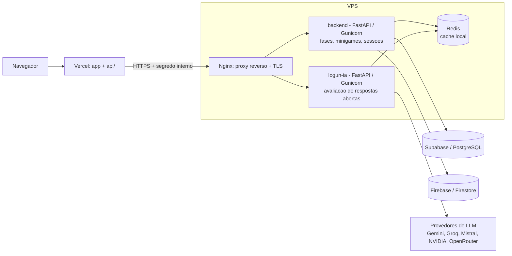

# VPS Services

Esta pasta reúne os serviços do Experience Connect que rodam em VPS própria, fora
do ambiente serverless da Vercel. São dois serviços independentes:

- **`backend/`** — API em FastAPI para a lógica de jogo sensível a latência:
  composição de fases, minigames e sessões. Mantém cache local em Redis e usa
  Supabase e Firebase como fontes de dados.
- **`logun-ia/`** — serviço de avaliação de respostas abertas por IA. Recebe o
  texto do jogador, aplica validação e roteamento entre provedores de modelo, e
  devolve nota e feedback.

A escolha por uma VPS separada cobre dois pontos que não se encaixam bem em
funções serverless: estado de cache de baixa latência (Redis local) e execução
de avaliação por IA com tempo e custo mais previsíveis.

## Arquitetura

O tráfego do jogador entra pela aplicação Vercel. As rotas serverless chamam a
VPS por HTTPS, autenticadas por um segredo interno. Na VPS, o Nginx faz proxy
reverso e TLS para os dois serviços.



## Estrutura

```text
vps-deployment/
├── backend/                  FastAPI: fases, minigames e sessoes de jogo
│   ├── app/                  codigo da aplicacao (api, core, db, services)
│   ├── tests/                testes de servico
│   ├── gunicorn.conf.py      configuracao do Gunicorn
│   └── requirements.txt
└── logun-ia/                 FastAPI: avaliacao de respostas abertas por IA
    ├── logun/
    │   ├── router.py         orquestracao e selecao de provedor
    │   ├── providers/        integracoes com LLMs e motor de regras
    │   ├── validators/       PII, anti-injecao, schema e validacao hibrida
    │   ├── skills/           classificar, avaliar, extrair, resumir
    │   ├── core/             prompt builder, rubric loader, auditoria
    │   ├── config/           configuracao e constantes
    │   ├── prompts/          (privado) modelos de prompt
    │   ├── rubrics/          (privado) rubricas de pontuacao
    │   └── data/             (privado) dados de apoio
    ├── challenge-contexts/   (privado) contextos de avaliacao por desafio
    └── tests/
```

## O que é publicado

O código-fonte dos dois serviços é versionado, incluindo testes. Ficam **fora**
do repositório, por padrão:

- segredos e variáveis de ambiente (`.env`, `.env.*`); apenas os `.env.example`
  são mantidos como referência;
- conteúdo de avaliação — prompts, rubricas, contextos de desafio e dados de
  apoio. Esse material funciona, na prática, como gabarito: define como cada
  resposta é pontuada, e expô-lo permitiria contornar a avaliação. As pastas
  permanecem no repositório com um `README` que descreve seu papel;
- scripts de deploy, instalação e os guias operacionais de servidor, que
  dependem do ambiente e representam superfície de ataque sem valor de leitura.

## Serviços

- [backend](./backend/README.md) — API de fases, minigames e sessões.
- [logun-ia](./logun-ia/README.md) — avaliação de respostas abertas por IA.
